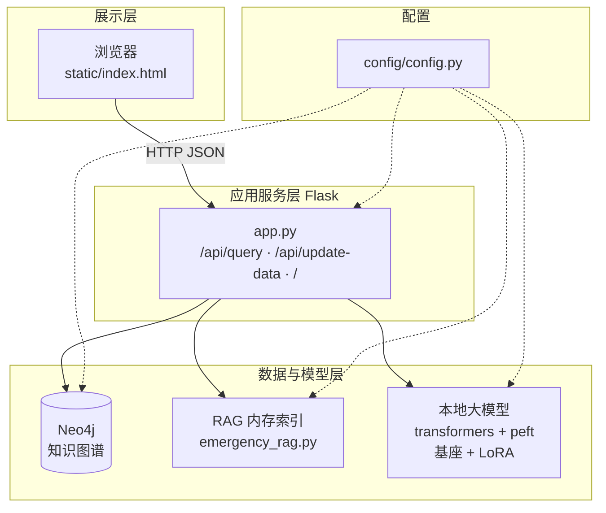
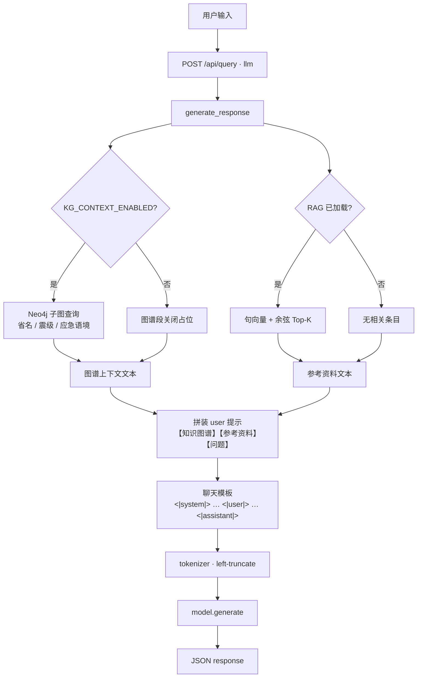
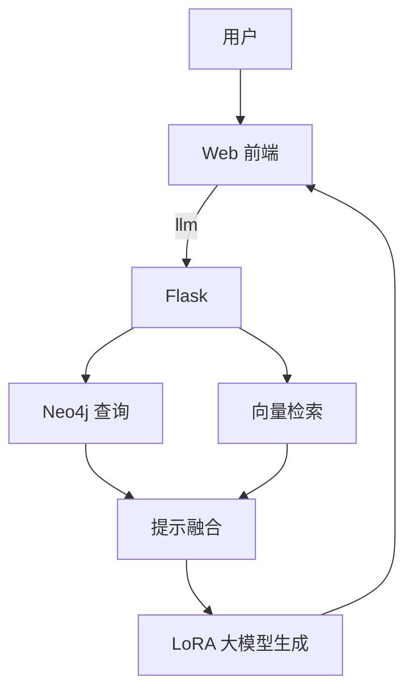
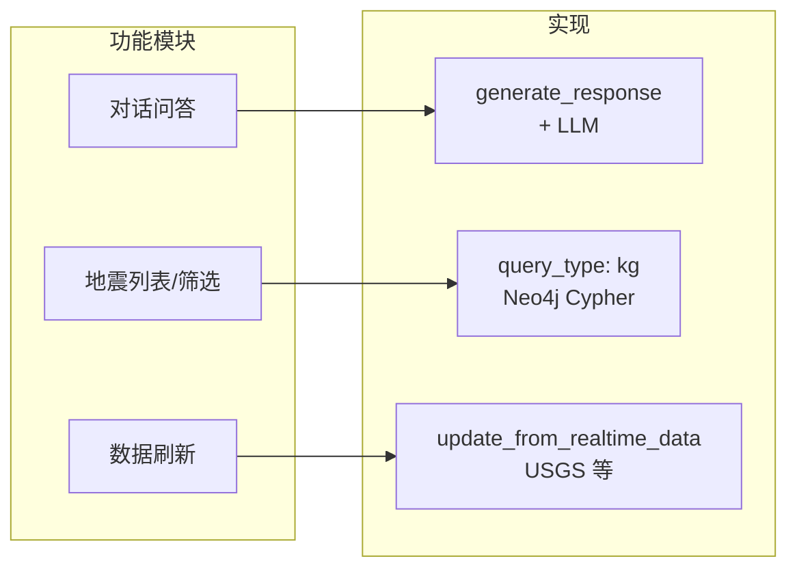
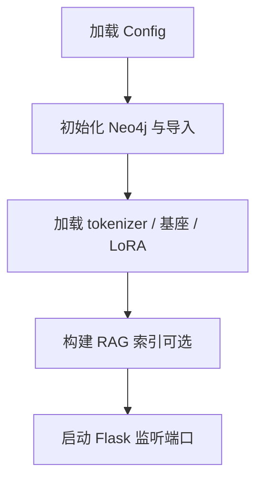

# 系统架构图（Mermaid 源）

在 VS Code 安装 **Mermaid** 插件预览，或复制代码块到 [Mermaid Live Editor](https://mermaid.live) 导出 **PNG/SVG** 插入 Word。

---

## 图 2-1-1 系统总体逻辑架构

---

## 图 2-1-2 问答请求数据流（`query_type: llm`）

> 说明：Mermaid 中尖括号需转义为 `&lt;` `&gt;`，导出图时显示为 `<|system|>` 等。

---

## 图 2-1-2b 简化纵向数据流（适合窄栏排版）

---

## 图 2-1-3 技术栈与模块映射

| 模块 | 主要代码 / 技术 | 职责 |
|------|-----------------|------|
| 前端 | `static/index.html` | 对话、地震列表、筛选、触发更新 |
| 应用网关 | `app.py`（Flask） | 路由、组装 KG/RAG 上下文、调用 LLM |
| 知识图谱 | `kg/neo4j_kg.py` + Neo4j | 地震事件、区域、应急主题与步骤 |
| 向量检索 | `rag/emergency_rag.py` + SentenceTransformer | `emergency_knowledge.json` 分块嵌入与 Top-K |
| 大模型 | Hugging Face `transformers` + `peft` | 基座 `MODEL_NAME` + 本地 LoRA 目录 |
| 配置 | `config/config.py` | Neo4j、路径、RAG/LLM 开关与超参 |

---

## 图：服务启动顺序（可选，第 6 章部署）

