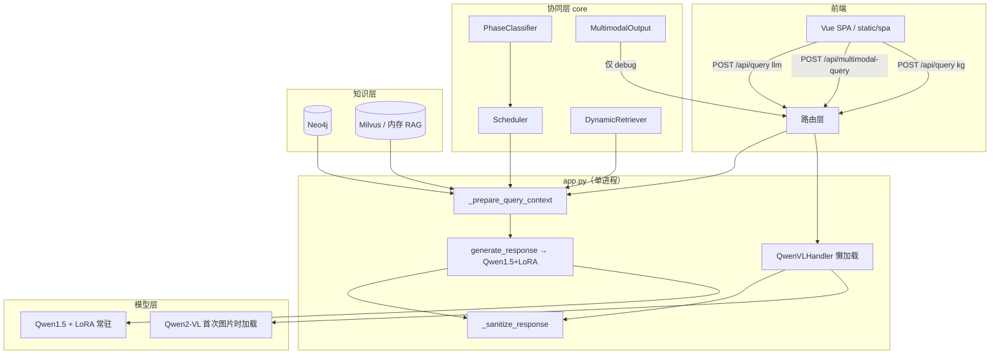
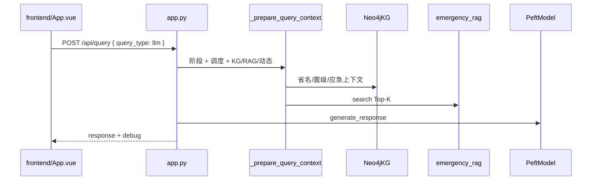

# 地震智能问答项目：逻辑梳理与优化建议

> 文档版本：2026-06-04  
> 适用代码路径：`/Users/xiaoxiaoqingnian/Desktop/biyelunwen`

---

## 一、系统在做什么

本项目面向**地震应急问答**，将以下能力组合为一条链路：

- **知识图谱（Neo4j）**：结构化地震事件、区域、应急知识节点  
- **向量检索（RAG）**：`emergency_knowledge.json` 的语义 Top-K  
- **动态数据（USGS）**：实时地震目录，带 TTL 缓存  
- **本地大模型**：文本路径为 Qwen1.5-1.8B + LoRA；图片路径为 Qwen2-VL 端到端  
- **阶段协同**：震前 / 震中 / 震后分类 + 不确定性感知调度器  

---

## 二、整体架构



### 目录与主入口

| 路径 | 职责 |
|------|------|
| `app.py` | Flask 主应用：路由、LLM 加载、上下文组装、推理 |
| `config/config.py` | 全局配置（类属性，无 `.env` 层） |
| `core/` | 阶段分类、调度、动态检索、多模态资源匹配 |
| `kg/neo4j_kg.py` | 生产用 Neo4j 图谱 |
| `rag/` | 应急知识向量检索（内存 / Milvus） |
| `llm/` | Qwen-VL、LoRA 产物、训练脚本、独立推理服务 |
| `frontend/` | Vue 3 + Vite 源码 |
| `static/spa/` | 前端构建产物（Flask 托管） |
| `data/` | 地震目录、应急知识、多模态资源 JSON |
| `docker-compose.yml` | Neo4j + Milvus 栈 |
| `scripts/scheduler.py` | 定时更新 KG（`schedule` 库，非 `core/scheduler.py`） |

| 入口 | 说明 |
|------|------|
| `python app.py` | 默认 `0.0.0.0:8000` |
| `frontend` → `npm run build` | 输出到 `static/spa/` |
| `llm/serve_earthquake_expert.py` | 可选独立 LLM 服务（与 app 重复） |

---

## 三、核心请求流程

### 3.1 文本问答（主路径）



| 步骤 | 位置 | 说明 |
|------|------|------|
| 1 | `frontend/src/api.js` → `queryLlm()` | `POST /api/query`，`params.input` |
| 2 | `App.vue` → `sendMessage()` | 60s 超时；展示 `debug.phase`、`media_resources` |
| 3 | `app.py` → `query()` | `query_type == "llm"` |
| 4 | `_prepare_query_context()` | 分类 → 调度 → 拼接 KG / RAG / 动态段 |
| 5 | `generate_response()` | ChatML 拼接 + `model.generate()` |
| 6 | `_sanitize_response()` | 过滤跑偏、非中文、无关词表 |
| 7 | `multimodal_output.match_as_dicts()` | **仅写入 debug**，不进 prompt |

**KG 注入方式**：省名关键词列表 +「震级大于 X」正则 + `query_emergency_context()`，偏规则，非 NER。

### 3.2 图片问答

| 步骤 | 位置 | 说明 |
|------|------|------|
| 1 | `Composer.vue` / `imageCompress.js` | 选图时压缩（最长边 1280、JPEG） |
| 2 | `App.vue` → `sendImageMessage()` | 发送前再压缩 → `FormData` |
| 3 | `multimodal_query()` | `_compress_upload_image()` 服务端二次压缩 |
| 4 | `_prepare_query_context(for_vision=True)` | 与文本共用 KG/RAG/动态上下文 |
| 5 | `QwenVLHandler.generate()` | **不走文本 LoRA** |
| 6 | `multimodal_output` | 结果进 `debug.media_resources` |

### 3.3 知识图谱直查

- `POST /api/query`，`query_type: "kg"`  
- 直接调用 `kg.query_*`，不经过 LLM  

### 3.4 其它 API

| 路由 | 函数 | 作用 |
|------|------|------|
| `POST /api/update-data` | `update_data()` | USGS 合并 Neo4j + 清空动态缓存 |
| `POST /api/phase-classify` | `phase_classify()` | 单独阶段分类 |
| `GET /` | `index()` | SPA 或 legacy 页面 |

---

## 四、协同与知识模块

### 4.1 `core/phase_classifier.py`

- **输出**：`PhaseResult`（阶段、置信度、紧急度、`need_dynamic`、匹配关键词）  
- **方法**：`PhaseClassifier.classify(text)`，关键词加权  
- **阶段**：震前 / 震中 / 震后 / 通用  

### 4.2 `core/scheduler.py`

- **输入**：`PhaseResult`  
- **输出**：`ScheduleDecision`（`use_kg`、`use_rag`、`use_dynamic`、`prompt_suffix`、`validity_hint`）  
- **注意**：`SCHEDULER_DYNAMIC_CONFIDENCE_THRESHOLD` 在 `__init__` 读取，**`decide()` 内未使用**（死配置）  

### 4.3 `core/dynamic_retriever.py`

- USGS GeoJSON，`DYNAMIC_CACHE_TTL_SECONDS` 缓存  
- `fetch_for_phase()`：震前通常为空；震中/震后注入「动态信息」段  
- `invalidate_cache()`：在 `/api/update-data` 后调用  

### 4.4 `core/multimodal_output.py`

- 数据源：`data/multimodal_resources.json`  
- `match()`：关键词 + 阶段加分，按类型上限返回图片/链接  
- **`build_media_section()` 未被 `app.py` 调用**；资源不进 LLM prompt  

### 4.5 RAG（`rag/`）

| 文件 | 说明 |
|------|------|
| `emergency_rag.py` | `build_emergency_rag_from_config`，BGE + 内存余弦 |
| `milvus_rag.py` | Milvus FLAT；`RAG_MILVUS_REBUILD_ON_START` 控制删表重建 |

统一接口：`search(query, top_k)` → `app._build_rag_section()`。

### 4.6 Neo4j KG（`kg/neo4j_kg.py`）

- `run()`：空库导入 `real_earthquakes_catalog.json` + `emergency_knowledge.json`  
- 查询：按区域、震级、深度、全量等  
- `query_emergency_context(user_text, phase_tag)`：应急主题/步骤文本  
- **启动失败会 raise，阻塞 `app.py` 启动**  

### 4.7 未接入主应用

| 文件 | 状态 |
|------|------|
| `kg/in_memory_kg.py` | 遗留，`app.py` 未引用 |
| `kg/kg_manager.py` | py2neo 方案，未用于主链路 |
| `llm/serve_earthquake_expert.py` | 独立服务，聊天模板与 `app.py` 不一致 |

---

## 五、大模型推理路径

### 5.1 文本 LLM（`app.py` 模块级加载）

1. 设备：`mps` → `cuda` → `cpu`  
2. `AutoModelForCausalLM` + `PeftModel`（`FINETUNED_MODEL_PATH`）  
3. `generate_response()`：`<|im_start|>` 格式  
4. `tokenizer.truncation_side = "left"`，`LLM_INPUT_MAX_TOKENS`  

环境变量（模块顶层）：`HF_HUB_OFFLINE=1`、`TRANSFORMERS_OFFLINE=1`。

### 5.2 Qwen2-VL（`llm/qwen_vl_handler.py`）

- **懒加载**：首次 `generate()` 时加载  
- 限制：`QWEN_VL_MAX_PIXELS`、`QWEN_VL_MAX_IMAGE_EDGE`、上下文截断  
- 依赖：`qwen-vl-utils`、`torchvision`  

### 5.3 遗留

- `llm/vision_handler.py`：BLIP 已弃用，仅为兼容别名  

---

## 六、启动依赖（强 / 弱）

| 组件 | 失败后果 |
|------|----------|
| **Neo4j** `kg.run()` | **进程退出** |
| **文本 LoRA** | **进程退出** |
| **Milvus RAG** | `emergency_rag=None`，占位「无相关条目」 |
| **Qwen-VL** | 仅图片接口 500；文本问答不受影响 |

**推荐启动顺序**：

```bash
docker compose up -d neo4j          # 必需（当前代码）
# docker compose up -d              # 若用 Milvus RAG
source .venv/bin/activate
python app.py
```

---

## 七、主要配置项

| 配置 | 默认 | 影响 |
|------|------|------|
| `KG_CONTEXT_ENABLED` | True | 是否拼 KG 段 |
| `RAG_ENABLED` | True | 是否检索应急知识 |
| `RAG_USE_MEMORY_RAG` | False | True 则不用 Milvus |
| `RAG_MILVUS_REBUILD_ON_START` | True | 每次启动删表重建（慢） |
| `PHASE_CLASSIFIER_ENABLED` | True | 关闭则阶段恒「通用」 |
| `DYNAMIC_RETRIEVAL_ENABLED` | True | USGS 动态段 |
| `SCHEDULER_ENABLED` | True | 关闭则 KG/RAG 全开、动态关 |
| `MULTIMODAL_OUTPUT_ENABLED` | True | debug 中的媒体资源 |
| `QWEN_VL_ENABLED` | True | 多模态路由 |
| `UPLOAD_IMAGE_MAX_EDGE` | 1280 | 上传压缩 |
| `QWEN_VL_MAX_IMAGE_EDGE` | 768 | VL 推理前缩放 |
| `API_DEBUG_RAG` | False | **代码未读取**；成功时仍常返回 debug |

---

## 八、耦合与技术债

| 问题 | 位置 | 说明 |
|------|------|------|
| 上帝模块 | `app.py` ~740 行 | 路由、提示词、KG 规则、模型、清洗集中 |
| 双 Config | `app.config` + `Neo4jKG` 内 `Config()` | 改配置需两处心智 |
| 应急知识双写 | Neo4j + RAG 同 JSON | 无统一同步管道 |
| 省名列表三份 | `app.py`、`neo4j_kg.py`、前端 | 易不一致 |
| `instruction` 未使用 | `generate_response(instruction, ...)` | 死参数 |
| 调度器命名冲突 | `core/scheduler.py` vs `scripts/scheduler.py` | 易混淆 |
| 全局 Exception | `app.py` L86-89 | 过宽 |
| 文档过时 | `PROJECT_IMPLEMENTATION.md` | 仍写 InMemoryKG + Ollama |
| 构建产物进 Git | `static/spa/assets/*.js` 多哈希 | 与源码双轨 |
| 双模型显存 | 文本常驻 + VL 懒加载 | Mac MPS OOM 风险 |

---

## 九、优化建议（按优先级）

### P0 — 稳定性 / 可启动性

#### 1. 启动与外部依赖解耦

- **现状**：Neo4j / LLM 在 import 阶段失败即退出。  
- **建议**：Neo4j 失败 → 降级（KG 关闭 + API 提示）；LLM 懒加载；`start.sh` 内 `docker compose up -d neo4j`。

#### 2. Milvus 默认策略

- **现状**：`RAG_MILVUS_REBUILD_ON_START=True`，每次启动全量重建。  
- **建议**：生产 `False`；开发 `RAG_USE_MEMORY_RAG=True` 无 Docker 可跑。

#### 3. 双大模型内存

- **建议**：文本与 VL 互斥加载；或 VL 默认 `cpu`；或拆独立推理进程。

#### 4. 统一 Python 环境

- 强制 `.venv`；`requirements.txt` 锁版本；避免 base 3.13 与 venv 3.9 混用。

---

### P1 — 架构与可维护性

#### 5. 拆分 `app.py`

```
services/
  context_builder.py    # _prepare_query_context
  text_generator.py     # generate_response
  multimodal_service.py
routes/
  query.py, multimodal.py, kg.py
```

#### 6. 消除重复与死代码

- 省名列表 → `data/regions.json` 或 `constants.py`  
- 删除或实现 `SCHEDULER_DYNAMIC_CONFIDENCE_THRESHOLD`、`API_DEBUG_RAG`  
- 废弃 `in_memory_kg`、`kg_manager` 或移入 `legacy/`  
- 统一 `serve_earthquake_expert` 与 `app.py` 的 Chat 模板  

#### 7. 应急知识单管道

- 一次函数：Neo4j 导入 + RAG/Milvus 索引  
- 或：应急条文只走 RAG，Neo4j 只管地震事件  

#### 8. 多模态输出语义

- 改名 `SupplementalMediaMatcher`，或把 `build_media_section()` 摘要注入 prompt  

---

### P2 — 效果与工程化

#### 9. 上下文构建增强

- 用 `matched_keywords` 驱动 KG/RAG 查询  
- 简单 NER / 一次 LLM 抽取地点震级  
- 总上下文 token 预算（事实优先于长 RAG）  

#### 10. 可观测性

- 结构化日志：阶段、路由决策、耗时、模型名  
- `GET /api/health`：Neo4j / RAG / LLM / VL 分项  
- `Config` 支持 `.env`  

#### 11. 前端与 CI

- SPA 由 CI build，仓库少提交 hash 产物  
- 上传进度与压缩后体积提示  
- `debug` 仅开发模式返回  

#### 12. 测试与文档

- 更新 `PROJECT_IMPLEMENTATION.md`、`process.md`  
- 单测：`phase_classifier`、`scheduler`、`_prepare_query_context` 快照  
- 集成测试：mock Neo4j + 内存 RAG  

---

## 十、推荐落地顺序

| 阶段 | 动作 | 收益 |
|------|------|------|
| 第 1 周 | 默认内存 RAG + Neo4j compose 脚本 + 统一 venv | 新人可一键跑通 |
| 第 2 周 | 拆分 context_builder + `/api/health` + 修文档/死配置 | 可维护、可答辩 |
| 第 3 周 | VL/文本内存互斥或 VL CPU + debug 开关 | 图片问答稳定 |
| 第 4 周 | 应急知识单管道 + 上下文 token 预算 | 答案一致性与质量 |

---

## 十一、关键函数速查

| 函数 | 文件 |
|------|------|
| `_prepare_query_context` | `app.py` |
| `generate_response` | `app.py` |
| `multimodal_query` | `app.py` |
| `_compress_upload_image` | `app.py` |
| `PhaseClassifier.classify` | `core/phase_classifier.py` |
| `Scheduler.decide` | `core/scheduler.py` |
| `DynamicRetriever.fetch_for_phase` | `core/dynamic_retriever.py` |
| `MultimodalOutput.match_as_dicts` | `core/multimodal_output.py` |
| `build_emergency_rag_from_config` | `rag/emergency_rag.py` |
| `Neo4jKG.run` / `query_emergency_context` | `kg/neo4j_kg.py` |
| `QwenVLHandler.generate` | `llm/qwen_vl_handler.py` |
| `compressImageFile` | `frontend/src/utils/imageCompress.js` |
| `queryLlm` | `frontend/src/api.js` |

---

## 十二、相关文档

| 文档 | 路径 |
|------|------|
| 数据流说明 | `process.md` |
| 实现说明（部分过时） | `PROJECT_IMPLEMENTATION.md` |
| 架构图 | `docs/superpowers/architecture/architecture-diagrams.md` |
| RAG+KG 设计 | `docs/superpowers/specs/2026-03-25-rag-kg-integration-design.md` |

---

## 十三、小结

**主线清晰**：阶段感知 → 多源上下文 → 文本 / 视觉双推理 → 前端补充媒体展示。

**主要短板**：单文件耦合、强启动依赖、双模型资源、知识双写未同步、遗留代码与文档滞后。

**若只改三项**：① 开发默认内存 RAG + Neo4j compose；② 拆分 `_prepare_query_context`；③ 图片与文本模型内存互斥或 VL 用 CPU。
