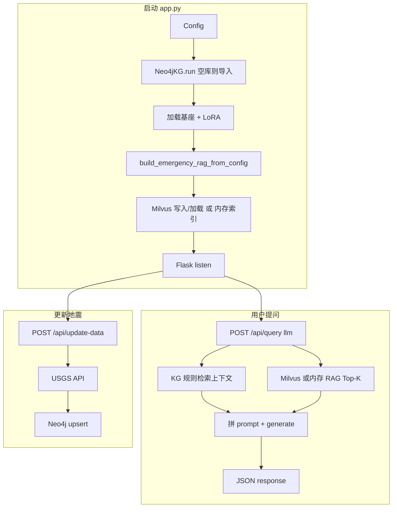

# 地震知识图谱 + RAG + 大模型应用 — 全流程说明

本文描述从启动服务、数据准备到用户提问与图谱更新的完整链路，并对**关键环节**单独标注。

---

## 1. 系统总览

| 层级 | 技术 | 作用 |
|------|------|------|
| 前端 | `static/spa/`（Vue 构建）或 `static/index.legacy.html` | 对话、地震列表、筛选、刷新数据 |
| 应用 | `app.py`（Flask） | 路由、组装 KG/RAG 上下文、调用本地 LLM |
| 知识图谱 | Neo4j + `kg/neo4j_kg.py` | 地震事件、区域、应急主题与步骤 |
| 检索增强 | `rag/emergency_rag.py` + `rag/milvus_rag.py` | 应急知识 JSON 分块 → `SentenceTransformer` 编码 → **Milvus** 存向量与正文元数据；检索为 **IP Top-K**（向量已 L2 归一化，等价余弦）。可选 `RAG_USE_MEMORY_RAG` 退回内存矩阵 |
| 大模型 | Hugging Face `transformers` + `peft` | `Qwen/Qwen1.5-1.8B` + LoRA 适配器 |
| 配置 | `config/config.py` | Neo4j、模型路径、RAG、解码参数等 |

**离线约束**：`app.py` 启动时设置 `HF_HUB_OFFLINE`、`TRANSFORMERS_OFFLINE`，基础模型与嵌入模型需**已缓存到本机**。

**Milvus**：默认通过 Docker Compose 与本仓库 `docker-compose.yml` 中的 `milvus-etcd` / `milvus-minio` / `milvus-standalone` 一并启动；应用连接 `MILVUS_HOST`:`MILVUS_PORT`（默认 `localhost:19530`）。向量与元数据持久化在 Docker 命名卷（如 `biyelunwen_milvus_*`），不在 `data/` 目录。

---

## 2. 服务启动流程（`python app.py`）

按**实际执行顺序**：

1. **加载配置**  
   `Config()` → Neo4j 地址、数据文件路径、`MODEL_NAME`、`FINETUNED_MODEL_PATH`、RAG/解码参数等。

2. **【重点】初始化 Neo4j 知识图谱**  
   - `Neo4jKG()` → `kg.run()`  
   - 建约束（`Earthquake` / `Region` / `EmergencyTopic` / `GuidanceStep` 唯一性）  
   - 若库中**尚无** `Earthquake` 节点：  
     - 优先：`REAL_EARTHQUAKE_CATALOG_FILE` + `EMERGENCY_KNOWLEDGE_FILE` 同时存在 → 导入应急知识关系 + 真实地震目录  
     - 否则：若存在 `EARTHQUAKE_DATA_FILE`（CSV）→ 兼容导入  
   - 失败则抛错，应用无法继续（图谱为强依赖）。

3. **【重点】加载大模型**  
   - 设备：`MPS` → `CUDA` → `CPU`；半精度优先于 GPU/MPS。  
   - `AutoModelForCausalLM.from_pretrained(MODEL_NAME, local_files_only=True)`  
   - `AutoTokenizer.from_pretrained`（同基座）  
   - `PeftModel.from_pretrained(base, FINETUNED_MODEL_PATH)`  
   - **`tokenizer.truncation_side = "left"`**：长提示必须从左侧截断，避免砍掉末尾的 `【问题】` 与 `<|assistant|>`（否则解码为空，前端显示「未收到有效回答」）。

4. **【重点】构建应急知识 RAG（可选）**  
   - `RAG_ENABLED` 为真时：`build_emergency_rag_from_config(config)`  
   - 读 `EMERGENCY_KNOWLEDGE_FILE`（默认 `data/emergency_knowledge.json`）→ 按 topic 拼 chunk → `SentenceTransformer` 编码（`normalize_embeddings=True`）  
   - **默认**：`build_milvus_emergency_rag`（`rag/milvus_rag.py`）连接 Milvus，创建/使用集合 `RAG_MILVUS_COLLECTION`（默认 `emergency_rag`）；`RAG_MILVUS_REBUILD_ON_START=True` 时每次启动**删集合并全量重建**（与 JSON 一致）；写入后建 **FLAT + IP** 索引并 `load`  
   - **可选**：`RAG_USE_MEMORY_RAG=True` 时不连 Milvus，使用 `EmergencyRAG` 内存矩阵 + 余弦 Top-K（与早期实现一致，便于无 Docker 环境）  
   - Milvus 不可达、`pymilvus` 异常或嵌入失败时：`emergency_rag = None`，推理时参考资料段为「无相关条目」。

5. **启动 Flask**  
   - `host=DEPLOY_HOST`，`port=DEPLOY_PORT`（默认 `0.0.0.0:8000`）；`debug` / `use_reloader` 由 `FLASK_DEBUG` 或环境变量决定（见 `app.py` 末尾）。

---

## 3. 用户对话主链路（LLM + RAG + KG）

**【重点】** 前端 `POST /api/query`，`query_type: "llm"`，`params.input` 为用户问题。

```
用户输入
    → generate_response(...)
         ├─（若 KG_CONTEXT_ENABLED）拼知识图谱上下文
         │    ├─ 省名命中 → query_earthquakes_by_region
         │    ├─ 「震级」+「大于/高于」+ 数字 → query_earthquakes_by_magnitude
         │    └─ 应急类触发词 → query_emergency_context（Neo4j 应急主题+步骤）
         ├─（若 RAG_ENABLED 且 RAG 已加载）_build_rag_section → `emergency_rag.search`（Milvus IP 检索或内存余弦）Top-K
         ├─ 拼成单一 user 提示：【知识图谱】【参考资料】+ 规则 + 【问题】（问题在**末尾**，利于 left-truncate）
         ├─ 套 `<|system|>…</s><|user|>…</s><|assistant|>` 与微调一致
         ├─ tokenize（max_length=LLM_INPUT_MAX_TOKENS）
         └─ model.generate（带 repetition_penalty、no_repeat_ngram_size 等，减轻复读）
    → JSON { "response": "..." }
```

前端若 `response` 非字符串或 `trim` 后为空 → 展示「未收到有效回答，请换种问法或稍后重试。」

**调试**：`config.API_DEBUG_RAG = True` 时可在响应中带 `debug`（如 `rag_topic_ids`）。

---

## 4. 知识图谱专用查询（前端列表/筛选）

**【重点】** `POST /api/query`，`query_type: "kg"`：

| `params.type` | 行为 |
|---------------|------|
| `all` | 全部地震节点，按时间降序 |
| `by_region` | `location CONTAINS region` |
| `by_magnitude` | 震级区间 |
| `by_depth` | 深度区间 |

用于页面加载地震数据与条件过滤，**不经过大模型**。

---

## 5. 实时数据更新链路

**【重点】** 用户触发「更新」→ `POST /api/update-data`：

1. `kg.update_from_realtime_data()`  
2. 内部调用 `scripts.earthquake_api.update_earthquake_data()`  
3. `get_recent_earthquakes()` 请求 **USGS** GeoJSON API（近 24 小时等参数）  
4. 对每条结果 `upsert_earthquake` 写入 Neo4j（`MERGE` by `id`，并尽量挂 `Region`）

依赖外网；失败时返回 0 条或错误信息。

---

## 6. 数据与脚本（离线/研发侧，非每次启动必跑）

以下为**准备数据或训练**时的常见路径，与运行时解耦：

| 方向 | 典型入口 | 说明 |
|------|----------|------|
| 爬取/生成地震数据 | `scripts/crawl_earthquake_data.py`、`scripts/fetch_real_earthquake_data.py`、`scripts/fetch_usgs_real_catalog.py` 等 | 产出或更新 JSON/CSV |
| 图谱 JSON 生成 | `scripts/generate_initial_kg_data.py` | 辅助 `kg_data` 等 |
| SFT 数据 | `llm/prepare_sft_data.py`、`data/sft_train.jsonl` | 对话微调语料 |
| 微调 | `llm/finetune_deepseek_r1_distill.py` 等 | 训练 LoRA，输出到 `llm/earthquake_expert_deepseek_r1/` |
| 独立推理服务 | `llm/serve_earthquake_expert.py` | 与 `app.py` 类似的加载与生成逻辑，可单独调试 |

**【重点】** 运行时真正消费的图数据入口仍是：`neo4j_kg.run()` 首次导入的 **JSON 目录 + 应急知识** 或 **CSV**；LoRA 目录需与当前 `peft` 版本兼容（适配器内含 `lora_bias` 等字段时需 `peft>=0.17`）。

---

## 7. 配置与依赖速查

- **Neo4j**：`NEO4J_URI` / `USER` / `PASSWORD`（默认 `bolt://localhost:7687`）。  
- **模型**：`MODEL_NAME`、`FINETUNED_MODEL_PATH`；解码见 `LLM_INPUT_MAX_TOKENS`、`LLM_MAX_NEW_TOKENS`、`LLM_REPETITION_PENALTY` 等。  
- **RAG**：`RAG_ENABLED`、`EMERGENCY_KNOWLEDGE_FILE`、`RAG_EMBEDDING_MODEL`、`RAG_EMBEDDING_LOCAL_FILES_ONLY`、`RAG_TOP_K`、`RAG_MAX_CHUNK_CHARS`；Milvus 侧 `MILVUS_HOST`、`MILVUS_PORT`、`RAG_MILVUS_COLLECTION`、`RAG_MILVUS_REBUILD_ON_START`；内存回退 `RAG_USE_MEMORY_RAG`。  
- **消融**：`KG_CONTEXT_ENABLED`、`RAG_ENABLED` 可关闭对应分支。  
- **Python 依赖**：见 `requirements.txt`（`transformers`、`peft`、`neo4j`、`sentence-transformers`、`pymilvus`、`flask` 等）。

---

## 8. 端到端流程简图



---

## 9. 重点流程小结（ checklist ）

1. **【重点】** Neo4j 必须先可用；空库时自动从 JSON/CSV **一次性导入**。  
2. **【重点】** 使用默认 RAG 路径时 **Milvus**（及 etcd、MinIO）需已启动（如 `docker compose up -d`）；否则可设 `RAG_USE_MEMORY_RAG` 或关闭 `RAG_ENABLED`。  
3. **【重点】** 本机需已缓存 HF 模型；`local_files_only=True`。  
4. **【重点】** 对话 = **图谱规则上下文 + RAG 片段 + 模板化 prompt + LoRA 生成**；截断策略与「问题在末尾」直接影响是否空回答。  
5. **【重点】** 解码参数影响复读与长度；可按 `config` 调整。  
6. 地震列表 = **纯 Cypher 查询 API**，与 LLM 分离。  
7. 实时更新 = **USGS → earthquake_api → Neo4j**，需网络。

---

*文档随仓库当前结构整理；若移动模块或改路由，请同步更新本文件。*
